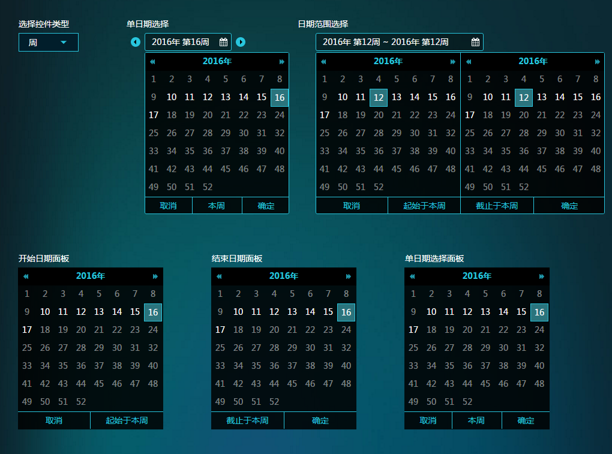

# date-picker-react
A react date picker control

##Installation
    npm install date-picker-react

##Demo


##Usage
```js
import DatePanel,{SinglePicker,RangePicker} from 'DatePicker';
var Me = React.createClass({
    getInitialState() {
        return { date:new Date()};
    },
    render(){
        return <SinglePicker
            type={'date'}
            value={this.state.date}
            onChange={date=>this.setState({date:date})}
        />
    }
});

dom.render(<Me />, document.getElementById('container'));
```

##Single Picker Props
Name|Type|Description
---|---|---
type|string|'date','week','month','year'
value|Date|selected date
onChange|Function|callback,用户点击确定按钮时触发, 1 param:the date
style|Object|css style to be used on the component
verify|Function|用于指定可选日期。具体见下方'verify'小节


##Range Picker Props
Name|Type|Description
---|---|---
type|string|'date','week','month','year'
from|Date|when the time range starts
to|Date|when the time range ends
onChange|Function|callback,用户点击确定按钮时触发, 2 param2:from,to(type:date)
style|Object|css style to be used on the component
verify|Function|用于指定可选日期。具体见下方'verify'小节
onError|Function|callback to handle errors


##DatePanel Props
Name|Type|Description
---|---|---
type|string|'date','week','month','year'
value|Date|selected date
onChange|Function|callback,用户点击任意日期时触发, 1 param:the date
style|Object|css style to be used on the component
position|string|'from','to','single'。用于指定面板类型，是开始日期还是结束日期还是独立日期
onCancel|Function|callback,当用户点击取消按钮时触发
onConfirm|Function|callback,当用户点击确定按钮时触发
verify|Function|用于指定可选日期。具体见下方'verify'小节


##The 'verify' Function

- 它用来指定可选日期，如果未被指定，则所有的日期都可选  
- 它会在渲染时被多次调用，每一个可选日期格子被渲染时都会来询问是否可选  
- 下面的样例代码中的控件，将只允许2015-4-14 ~ 2016-6-14日之间的日期被选择。可以加入更复杂的逻辑以支持更复杂的可选时间段。比如额外判定某特定日期也可以被选择。
```js
<SinglePicker
    type={'date'}
    verify={(date,type)=>
                new Date(2015,3,14).getTime()<= date.getTime()
                && date.getTime() <= new Date(2016,5,14).getTime()
            }
    ....
```

- 它有两个参数，第一个Date类型，用于判断是否可选  
- 第二个参数string类型，type，即'date','week','month','year'  
- 第二个参数用于帮助判断当前日期是否可用，因为对于像'year'这样的类型，***收到的日期将是那年的第一天***，而你手里用来比较的日期可能是年内的某一段时间，这样日期就会落在范围外。但实际上该年应该可选。这需要额外的处理才能正确工作。而这些处理需要依赖控件类型。  


